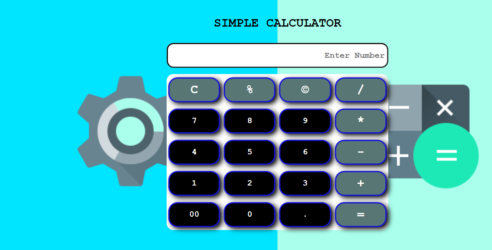

# Basic Calculator

A simple calculator built using **HTML**, **CSS**, and **JavaScript**. This project demonstrates the basic functionality of a calculator, including addition, subtraction, multiplication, and division.

## Features

- Addition, subtraction, multiplication, and division operations.
- Responsive design for different screen sizes.
- Clear button to reset the calculator.

## Technologies Used

- **HTML**: For structuring the calculator interface.
- **CSS**: For styling the calculator.
- **JavaScript**: For implementing the calculator's functionality.

## How to Use

1. Clone or download this repository.
2. Open `index.html` in your browser.
3. Start performing calculations by clicking the buttons.

## Future Improvements

- Add keyboard support for input.
- Implement additional functionalities.
- Enhance the design with animations and more responsive layouts.

## Project Preview

## Live Demo
You can view the live project here: [Simple Calculator](https://renubakshi.github.io/simple-calculator/)

**Author**: Renu Bakshi  
**GitHub**: [Renubakshi](https://github.com/Renubakshi)
